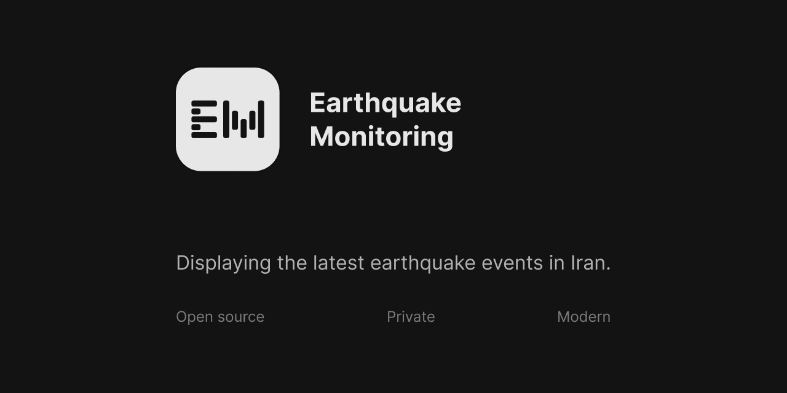

> **Warning**
> This Project is no longer maintained, there might be vulnerabilities in dependencies!
> Use it at your own risk!

> **Warning**
> Some of the docker images are incompatible with ARM architecture!

> **Warning**
> Due to new Geolocation limitations from the Tehran geo physics center, only Iranian IPs can reach the API. 
> Therefore you have to follow this guide to display earthquakes. 
> Firstly you need to start the databases in development mode. 
> Be sure you have `docker` and `docker-compose`, before running the commands.
>```bash
> cd docker
> sudo docker compose -f ./docker-compose.dev.yml up -d
>```
> Then you need to start a Prisma studio server. 
> Keep in mind you need `pnpm` and `node.js` for the following commands. 
> Open another terminal and run the following commands.
> ```bash
> cd cronjob
> pnpm install
> pnpm run prisma-init
> pnpm run prisma-generate
> pnpm run prisma-init
> pnpm run prisma-studio
> ```
> Lastly, you can add the necessary data manually with the help of Prisma studio. 
> After data insertion, close the Prisma studio by clicking `left-control + C` ( Windows and Linux ) or `command + C` on MacOS. 
> Write the following commands on the first terminal to start the prod containers.
> ```bash
> sudo docker compose -f ./docker-compose.dev.yml down
> sudo docker compose -f ./docker-compose.prod.yml up -d
> ```



# Earthquake monitoring

## About 🪪
This project is the final project of my bachelors of computer engineering program. The goal of the project is to help to distribute the earthquake information to the masses, therefore the project is designed to be scalable and reliable. Project has been built on reliable and battle tested solutions. Here are a short list of libraries in use in different parts of the application:

### [Web](./web):
- mantine ( styled components for React )
- ajv ( schema validation )
- geolib ( utils for geo calculations )
- leaflet	( interactive maps )
- next
- rcode.react ( Generating Qr-codes )
- redis ( Client for Redis database )
- prisma ( Client for Postgres database )
- swr ( Providing Client side data fetching )

### [Mobile](./mobile):
- mantine ( styled components for React )
- ajv ( schema validation )
- geolib ( utils for geo calculations )
- leaflet	( interactive maps )
- vite
- rcode.react ( Generating Qr-codes )
- prisma ( Generating types )
- swr ( Providing Client side data fetching )

### [Cronjob](./cronjob):
- prisma ( Client for Postgres database )
- fast-xml-parser ( Parsing Xml to json )

---

## Development setup 💻

### Requirements
- Node.js ( 18.7.0 or higher )
- pnpm ( 7.9.0 or higher )
- Docker ( 20.10.17 or higher )
- Docker compose ( 1.29.2 or higher )

### development databases
you need to run the following commands to start databases in docker
```bash
cd /docker
# You might need to change "docker compose" to "docker-compose"
docker compose -f docker-compose.dev.yml up -d
```

### Web development ( needs database to be online )
you need to run the following commands to start a development server:
```bash
cd /web
pnpm install # Installing dependencies
pnpm run init-prisma-schema # Generating prisma types
pnpm run prisma-migrate-dev # Applying schemas to database
pnpm run dev # Starting the development server
```

### Mobile development ( needs web to be online )
you need to run the following commands to do the initial setup:
```bash
cd /mobile
pnpm install # Installing dependencies
pnpm run prisma-types # generating prisma types
```

Then you can start PWA development by the following command
```bash
pnpm run pwa-dev # Starting the development server
```
Or run the following command to start dev server with android env files
```bash
pnpm run android-dev # Starting the development server
```

### Cronjob ( needs database to be online )
you need to run the following commands to start a development server:
```bash
cd /web
pnpm install # Installing dependencies
pnpm run init-prisma-schema # Generating prisma types
pnpm run prisma-migrate-dev # Applying schemas to database
pnpm run dev # Starting the development server
```

---

## Hosting 🔥

### software requirements:
- Docker ( 20.10.17 or higher )
- Docker compose ( 1.29.2 or higher )

### Hardware requirements:
- Storage: 5G or more
- Ram: 512mg or more
- Cpu: 2cores or more

### Guide
you need to run the following commands to start hosting server, keep in mind in case your server user is root, you need to make some changes in web [Dockerfile](./web/Dockerfile). Before hosting your application you have to update couples of env files in `compose.prod.yml`, we recommend making a copy of the original file and applying your changes to the copied version.
```bash
cd /docker
cp  docker-compose.prod.yml docker-compose.local.yml # then update the new file and add your env files
# You might need to change "docker compose" to "docker-compose"
docker compose -f docker-compose.local.yml up -d
```

## Building application
please read our guide in [here](./app/README.md)
