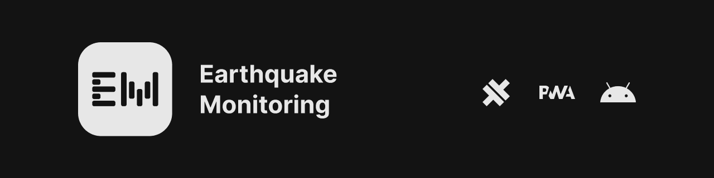

# Application

Application code will be used to create a PWA, Android, Windows, Linux versions of the webapp.

## Building for android

### Requirements
- Node.js ( 18.7.0 or higher )
- pnpm ( 7.9.0 or higher )
- Android Studio

### Building web data
first you need to run the following commands, after all of them completed successfully, then you can open `android` folder inside `mobile` folder, with android studio.
```bash
cd ./app
pnpm install # Installing dependencies
pnpm run prisma-types # Generating prisma types
npx cap add android # Generating android app scaffolding with capacitor.js
pnpm run build-android # building web application and setting up android files
```

## Building for desktop

### Requirements
- Node.js ( 18.7.0 or higher )
- pnpm ( 7.9.0 or higher )

### Building web data
first you need to run the following commands, after all of them completed successfully, your application code can be founded at `app/dist`, directory.
```bash
cd ./app
pnpm install # Installing dependencies
pnpm run electron-build # building web application and setting up android files
```